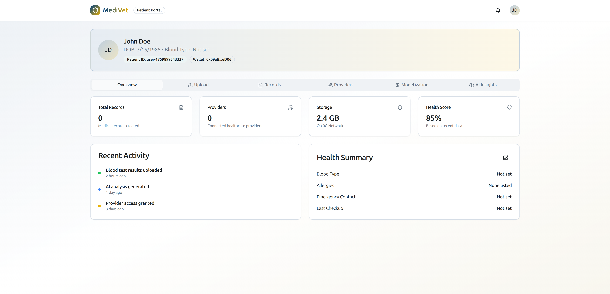
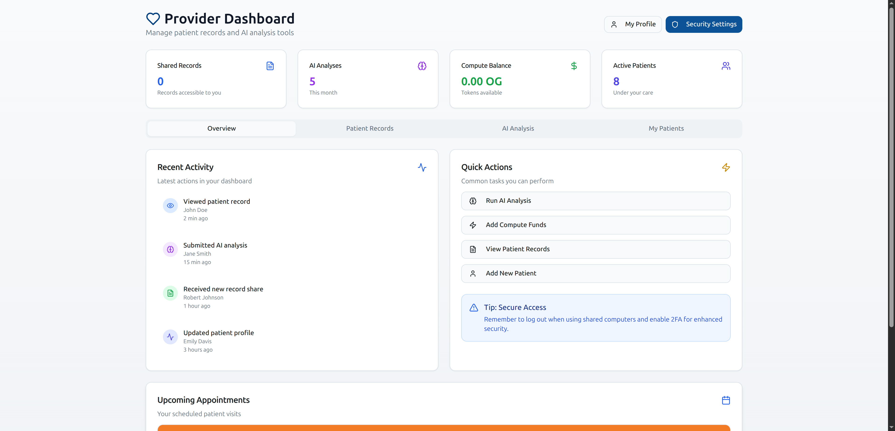
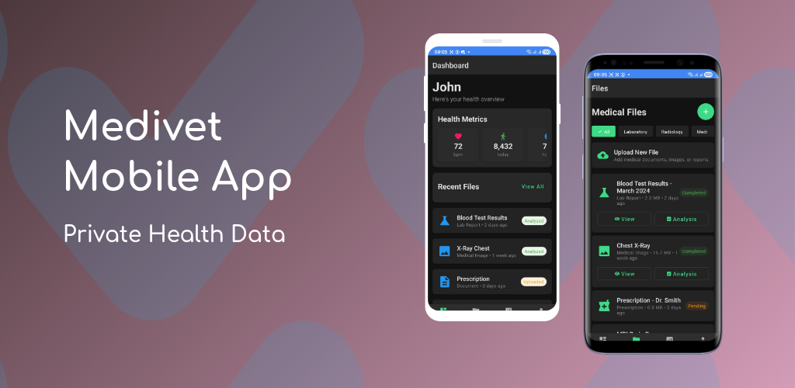
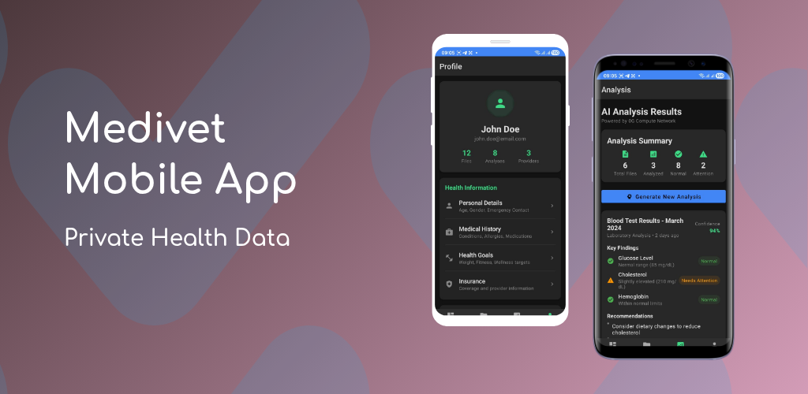
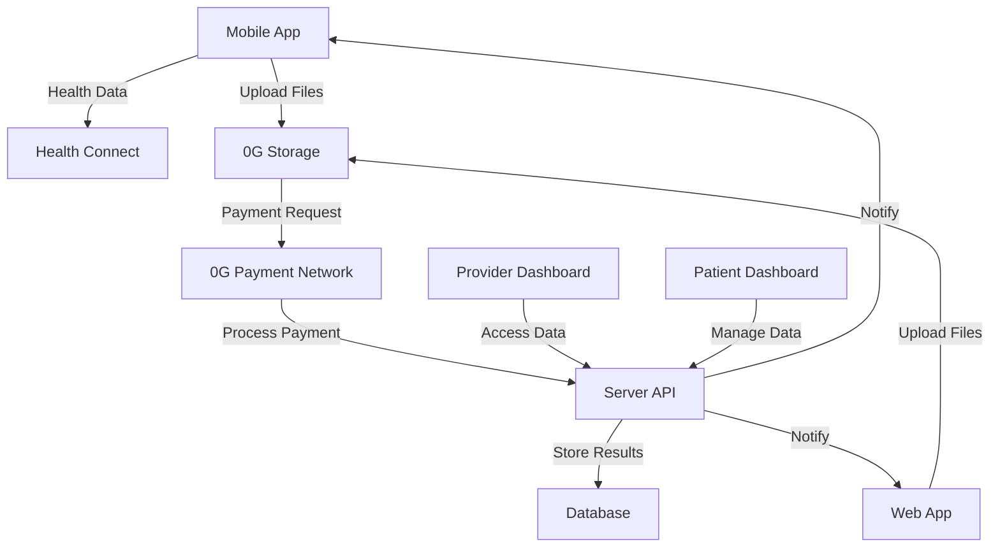

# 🏥 MediVet - Decentralized Medical Data Platform

**Secure medical data management powered by 0G Storage and blockchain technology**

[](https://0g.ai/)
[](https://0g.ai/)
[](https://reactjs.org/)
[](https://developer.android.com/)
[](https://expressjs.com/)

## 🌟 Overview

MediVet is a revolutionary decentralized platform that enables secure medical data storage, sharing, and AI-powered analysis using 0G Network's cutting-edge blockchain infrastructure. Built for patients, healthcare providers, and researchers, MediVet ensures data privacy, ownership, and accessibility while creating new opportunities for medical data collaboration.

## 🎯 Alpha Release - First Upload to 0G Storage

**🔐 MediVet NFT Alpha Image Successfully Processed**

- **File**: `medivet-nft.png`
- **Size**: 1,125,944 bytes (1.1MB)
- **Hash**: `0x02d42e3da62c1cab3f0db17a8a1ac90c6f4ba31b58cd9efdaf4f6046c08f8ee7`
- **Network**: 0G Storage Turbo
- **Timestamp**: 2025-11-04T20:07:32+03:00
- **Status**: ✅ Hash Generated & Ready for Contract Registration

This represents the first official MediVet asset prepared for 0G Network integration, marking the beginning of decentralized medical data storage on the platform.

### 🎥 Platform Demo

<!-- TODO: Add platform overview video -->

*Complete platform walkthrough showing web, mobile, and AI analysis features*

## 🏗️ Architecture

MediVet consists of three integrated components:

```
medData/
├── web/          # React web application
├── server/       # Express.js backend API
├── android/      # Android mobile application
└── docs/         # Documentation and media
```

### 📱 Multi-Platform Experience

| Platform | Technology | Purpose |
|----------|------------|---------|
| **Web** | React + TypeScript | Patient & Provider dashboards |
| **Mobile** | Android + Health Connect | Health data collection & sync |
| **Server** | Express.js + 0G SDK | API & blockchain integration |

## ✨ Key Features

### 🔐 **Decentralized Storage**
- **0G Storage Network**: Medical files stored on decentralized infrastructure
- **End-to-end Encryption**: Patient data protected with advanced cryptography
- **Ownership Control**: Patients retain full control over their medical data
- **HIPAA Compliance**: Built with healthcare privacy regulations in mind

### 💰 **Payment-Based Access**
- **0G Payment Network**: Automated payments for medical data access
- **Real-time Processing**: Instant payment verification for data requests
- **Privacy-First**: Payment processing without compromising data privacy
- **Smart Contracts**: Automated payment distribution using blockchain technology

### 📊 **Smart Data Management**
- **Multi-format Support**: PDFs, images, lab results, and Health Connect data
- **Intelligent Categorization**: Automatic organization by medical specialty
- **Cross-Platform Sync**: Seamless data sync between web and mobile
- **Version Control**: Track changes and updates to medical files

### 🤝 **Provider Collaboration**
- **Selective Sharing**: Grant access to specific healthcare providers
- **Real-time Updates**: Providers see the latest patient information
- **Audit Trail**: Complete visibility into data access and modifications
- **Enhanced Analysis**: Provider-specific AI analysis with clinical context

## 🚀 Quick Start

### Prerequisites

- **Node.js 18+** and npm ([install with nvm](https://github.com/nvm-sh/nvm))
- **Android Studio** (for mobile development)
- **MetaMask** or compatible Web3 wallet
- **0G Network** access (testnet or mainnet)

### 🌐 Web Application

```bash
# Navigate to web directory
cd web

# Install dependencies
npm install

# Configure environment
cp .env.example .env
# Edit .env with your configuration

# Start development server
npm run dev
```

**Environment Configuration:**
```env
# API Configuration
VITE_API_BASE_URL=https://medivet-backend-72tq.onrender.com/api

# 0G Network Configuration
VITE_L1_RPC=https://evmrpc-testnet.0g.ai
VITE_STANDARD_STORAGE_RPC=https://indexer-storage-testnet-standard.0g.ai
VITE_TURBO_STORAGE_RPC=https://indexer-storage-testnet-turbo.0g.ai

# Web3Modal Configuration
VITE_PROJECT_ID=your_walletconnect_project_id
```

### 🖥️ Server Backend

```bash
# Navigate to server directory
cd server

# Install dependencies
npm install

# Configure environment
cp .env.example .env
# Add your 0G private key and configuration

# Start server
npm start
```

**Environment Configuration:**
```env
# 0G Network Configuration
ZG_PRIVATE_KEY=your_private_key_here
ZG_RPC_ENDPOINT=https://evmrpc-testnet.0g.ai

# Database Configuration
DATABASE_URL=your_database_url

# API Configuration
PORT=3001
```

### 📱 Android Application

```bash
# Navigate to android directory
cd android

# Open in Android Studio
# File > Open > select android directory

# Sync project with Gradle files
# Build > Make Project

# Run on device/emulator
# Run > Run 'app'
```

**Requirements:**
- Android API level 27 or greater
- Health Connect APK installed (for Android 13 and lower)

## 📸 Screenshots & Features

### 🌐 Web Application

#### Patient Dashboard
<!-- TODO: Add patient dashboard screenshots -->

*Patient dashboard showing file upload, AI analysis, and provider management*

#### Provider Dashboard  
<!-- TODO: Add provider dashboard screenshots -->

*Healthcare provider interface with patient data access and enhanced analysis*

#### Payment Processing Results
<!-- TODO: Add payment processing screenshots -->

*Real-time payment processing powered by 0G Payment Network*

### 📱 Mobile Application

#### Health Data Collection
<!-- TODO: Add mobile screenshots -->

*Android Health Connect integration for automatic health data collection*

#### File Upload & Sync
<!-- TODO: Add mobile upload screenshots -->

*Mobile file upload with automatic sync to 0G Storage*

### 🎬 Feature Demonstrations

#### File Upload & AI Analysis Flow
<!-- TODO: Add upload flow video -->

*Complete flow from file upload to AI analysis results*

#### Provider Collaboration
<!-- TODO: Add collaboration video -->

*Healthcare provider requesting and accessing patient data*

#### Cross-Platform Sync
<!-- TODO: Add sync demonstration -->

*Data synchronization between web and mobile applications*

## 🔧 Technical Details

### Web Application (`/web`)

**Technology Stack:**
- React 18 with TypeScript
- Vite for fast development and building
- Tailwind CSS + shadcn/ui components
- 0G SDK integration (`@0glabs/0g-ts-sdk`)
- Zustand for state management
- React Query for API calls

**Key Features:**
- Patient & Provider dashboards
- File upload to 0G Storage
- Real-time AI analysis display
- Provider collaboration tools
- Responsive design

### Server Backend (`/server`)

**Technology Stack:**
- Express.js with TypeScript
- 0G Storage SDK integration
- 0G Compute Network integration
- SQLite for job tracking
- Railway deployment

**Key Features:**
- RESTful API endpoints
- 0G Storage file management
- Payment processing integration
- User authentication
- Rate limiting & security

### Android Application (`/android`)

**Technology Stack:**
- Android SDK (API 27+)
- Health Connect integration
- Kotlin/Java
- Material Design components

**Key Features:**
- Health Connect data collection
- File upload to 0G Storage
- Cross-platform data sync
- Offline capability

## 🔄 Data Flow Architecture



## 🛡️ Security & Privacy

### Data Protection
- **End-to-end Encryption**: All medical data encrypted before storage
- **Decentralized Storage**: No single point of failure with 0G Network
- **Patient Ownership**: Patients control all data access permissions
- **Audit Trail**: Complete logging of all data access and modifications

### Privacy Features
- **Selective Sharing**: Granular control over data sharing with providers
- **Anonymization**: AI analysis can use anonymized data for research
- **Consent Management**: Explicit consent required for all data operations
- **HIPAA Compliance**: Built with healthcare privacy regulations in mind

### Blockchain Security
- **Immutable Records**: Blockchain-based audit trail
- **Smart Contracts**: Automated access control and permissions
- **Decentralized Identity**: Web3 wallet-based authentication
- **Zero-Knowledge Proofs**: Privacy-preserving verification (future)

## 🧪 Testing & Development

### Running Tests

```bash
# Web application tests
cd web && npm test

# Server tests  
cd server && npm test

# Android tests
cd android && ./gradlew test
```

### Development Workflow

1. **Feature Development**: Create feature branch from main
2. **Testing**: Run unit and integration tests
3. **Build Verification**: Ensure all platforms build successfully
4. **Code Review**: Submit PR for review
5. **Deployment**: Merge to main triggers deployment

### Test Data

Sample medical records and test data are available for development:

```bash
# Load sample data (web)
cd web && npm run load-sample-data

# Generate test health data (android)
cd android && ./gradlew generateTestData
```

## 🚀 Deployment

### Web Application
- **Platform**: Vercel/Netlify
- **Build Command**: `npm run build`
- **Environment**: Configure via platform settings

### Server Backend
- **Platform**: Railway
- **Auto-deploy**: Connected to GitHub main branch
- **Database**: PostgreSQL (production) / SQLite (development)

### Android Application
- **Distribution**: Google Play Store
- **Build**: Android Studio or CI/CD pipeline
- **Signing**: Configure keystore for release builds

## 🗺️ Roadmap

### Version 1.0 (Current)
- ✅ Web application with patient/provider dashboards
- ✅ 0G Storage integration for file management
- ✅ Smart contract integration for payments
- ✅ Android Health Connect integration
- ✅ Cross-platform data synchronization

### Version 1.1 (Next Quarter)
- 🔄 Enhanced privacy-preserving analysis techniques
- 🔄 Real-time collaboration features
- 🔄 Mobile app UI improvements
- 🔄 Advanced privacy controls
- 🔄 Integration with major EHR systems

### Version 2.0 (Future)
- 📋 Decentralized research networks
- 📋 Blockchain-based medical credentials
- 📋 Global health data standards compliance
- 📋 Advanced analytics and insights
- 📋 Multi-language support

## 🤝 Contributing

We welcome contributions from the community! Here's how you can help:

### Development Setup

```bash
# Clone the repository
git clone https://github.com/your-org/medData.git
cd medData

# Set up each component
./setup-dev.sh  # Runs setup for web, server, and android
```

### Contribution Guidelines

- Follow existing code style and conventions
- Write tests for new features
- Update documentation for API changes
- Ensure all platforms build successfully
- Use conventional commit messages

### Areas for Contribution

- 🔐 **Security**: Enhance encryption and privacy features
- 🏥 **Medical AI**: Improve health analytics and insights
- 🌐 **Integration**: Connect with healthcare systems
- 📱 **Mobile**: Enhance Android application features
- 📚 **Documentation**: Improve guides and tutorials

## 📄 License

This project is licensed under the MIT License - see the [LICENSE](LICENSE) file for details.

## 🙏 Acknowledgments

- **0G Labs** for providing cutting-edge decentralized storage and payment infrastructure
- **Medical Community** for guidance on healthcare data standards
- **Open Source Contributors** for their valuable contributions
- **Patients and Providers** for testing and feedback

## 🔗 Deployed Contracts

### 0G Mainnet (Production)
- **MedicalRecordAccess**: `0xA6347e1dCb5f4C80FF2022850106Eb5C7bF07f57`
- **Network**: 0G Mainnet (Chain ID: 16661)
- **Explorer**: [View on 0G Explorer](https://chainscan.0g.ai/address/0xA6347e1dCb5f4C80FF2022850106Eb5C7bF07f57)

### 0G Galileo Testnet
- **MedicalRecordAccess**: `0x6a301456A5274dF720913Ec5C9A48992DFF2a830`
- **Network**: 0G Galileo Testnet (Chain ID: 16602)
- **Explorer**: [View on 0G Explorer](https://chainscan-galileo.0g.ai/address/0x6a301456A5274dF720913Ec5C9A48992DFF2a830)

## 🔗 Quick Links

| Component | Live Demo | Documentation | Status |
|-----------|-----------|---------------|--------|
| **Web App** | [medivet-data.netlify.app](https://medivet-data.netlify.app/) | [Web Docs](./web/README.md) | ✅ Live |
| **API Server** | [medivet-backend-72tq.onrender.com](https://medivet-backend-72tq.onrender.com) | [API Docs](./server/README.md) | ✅ Live |
| **Android App** | [APK Download](./android/apk/) | [Android Docs](./android/README.md) | 🔄 Beta |

---

